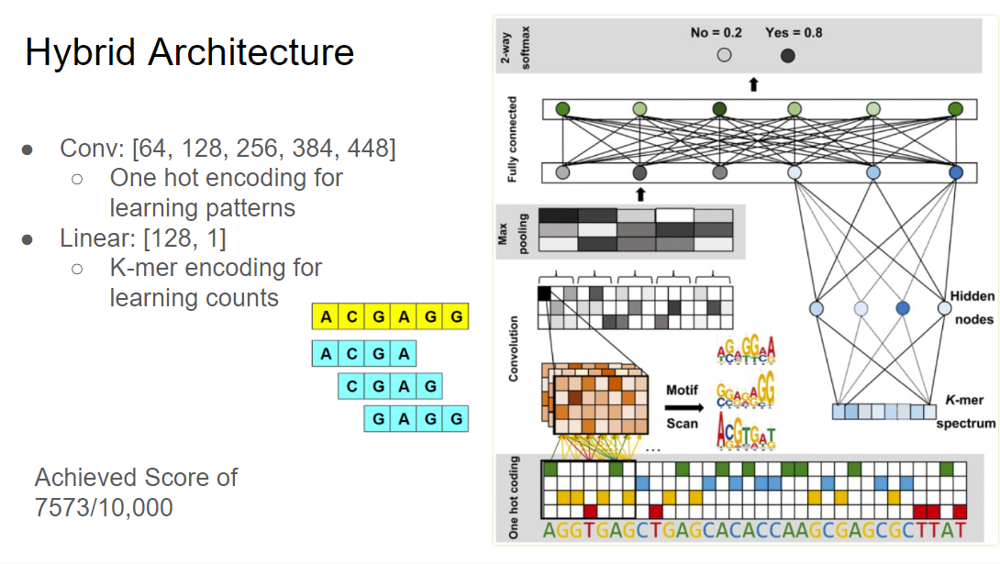
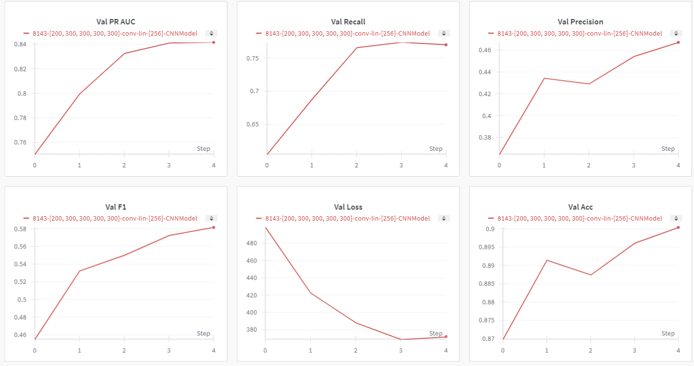
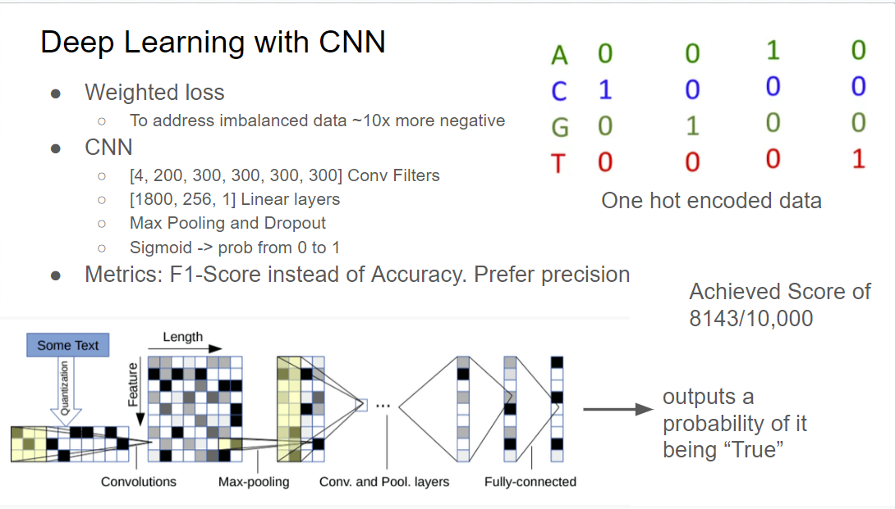
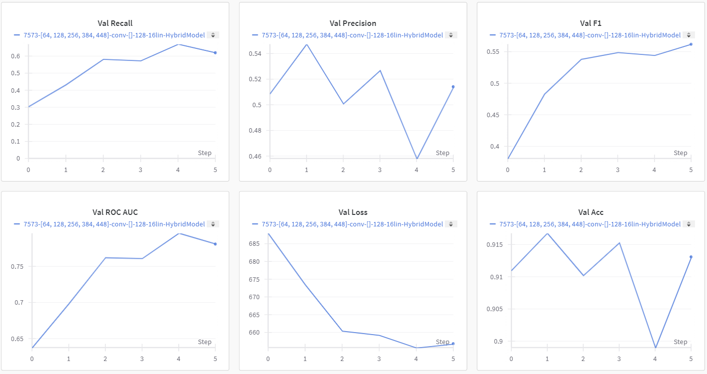

# dna-ml-model

This project won 2nd place in a Computational Biology "Hackathon" (despite the name, it was formatted more like a Kaggle competition). It is a machine learning model for predicting if a given DNA sequence is chromatin accessible. The task was dificult because of the strong imbalance in both the dataset and the testing data. This README.md explains two different architecures I experimented with: Hybrid and CNN.

### Methods

- Weighted BCE Loss to address the class imbalance
- Upsampling and downsampling - were experimented with, but were not used in the final model
- Metrics: F1-score, precision, and recall because of data imbalance

### Hybrid Model

In `HybridModel.py`, the model combines two components: a CNN and a feed forward network.

Please see the next section for details about the CNN since the HybridModel uses the exact same implementation (minus the sigmoid). The CNN takes a one hot encoded representation of the sequence. This effectively learns based on the **patterns** and ordering of the sequence.

The feed forward network instead takes k-mer encoding as input. k-mer's are a common technique for DNA sequences. Essentially, we consider all possible subsequences of size k, made up of the 4 DNA bases ['G', 'C', 'A', 'T'] and count the number of times each appears in our given sequence. This is represented as a vector that is inputted into the feed forward network. This effectively learns based on the k-mer **counts** of the data.

The two are then concatenated to learn based on both the patterns and the counts. After training, this model achieved a score of 7573, identifying 7573 of the 10,000 accessible sequences, given 269,315 sequences to choose from. While the following model achieved a better performance, this model architecture is a notable one.

  
Inspiration of the model architecture and the diagram representing it on the right was taken from the following research paper: [Chromatin accessibility prediction via a hybrid deep convolutional neural network](https://www.ncbi.nlm.nih.gov/pmc/articles/PMC6192215/)

### CNN Model

In `CNNModel.py`, this CNN model is a standard Convolutional Neural Network that is commonly used in Computer Vision and Natural Language Processing (NLP). The given sequence is represented using a one-hot encoding and is then fed into the CNN. The CNN learns the patterns based on the ordering and patterns of the bases in the sequences. This is very similar to how CNNs are used in the field of NLP. For a given sequence, the model uses a sigmoid activation function to output a value between 0 and 1 representing a probability of whether the label is positive (accessible) or negative (not accessible).

After training, this model achieved a score of 8143 (identifying 8143 of the 10,000 accessible sequences, given 269,315 sequences to choose from), falling not far behind the first place winner of the competition.

It appears that for this case, the ordering of the bases is more important and the CNN alone performs better than the CNN paired with the feed forward network (HybridModel).

